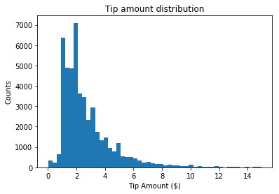
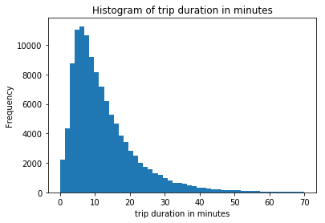
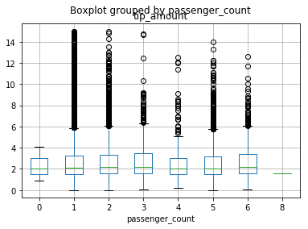
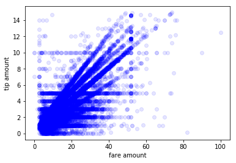
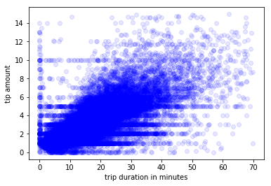
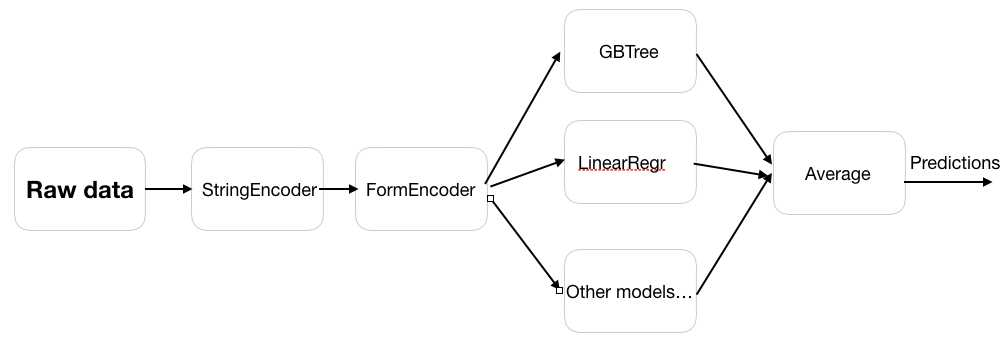

NYC Taxi Tip Prediction Model
==============================

Machine Learning Model for Predicting Tips in NYC Taxis

Project Organization
------------

    ├── LICENSE
    ├── Makefile           <- Makefile with commands like `make data` or `make train`
    ├── README.md          <- The top-level README for developers using this project.
    ├── data
    │   ├── external       <- Data from third party sources.
    │   ├── interim        <- Intermediate data that has been transformed.
    │   ├── processed      <- The final, canonical data sets for modeling.
    │   └── raw            <- The original, immutable data dump.
    │    │
    │
    ├── notebooks          <- Jupyter notebooks. Naming convention is a number (for ordering),
    │                         the creator's initials, and a short `-` delimited description, e.g.
    │                         `1.0-jqp-initial-data-exploration`.
    │
    ├── reports            <- Generated analysis as HTML, PDF, LaTeX, etc.
    │   └── figures        <- Generated graphics and figures to be used in reporting
    │
    ├── requirements.txt   <- The requirements file for reproducing the analysis environment, e.g.
    │                         generated with `pip freeze > requirements.txt`
    │
    ├── src                <- Source code for use in this project.
    │   ├── __init__.py    <- Makes src a Python module
    │   │
    │   ├── data           <- Scripts to download or generate data
    │   │   └── make_dataset.py
    │   │
    │   ├── features       <- Scripts to turn raw data into features for modeling
    │   │   └── build_features.py
    │   │
    │   ├── models         <- Scripts to train models and then use trained models to make
    │   │   │                 predictions
    │   │   ├── predict_model.py
    │   │   └── train_model.py
    │   │
    │   └── visualization  <- Scripts to create exploratory and results oriented visualizations
    │       └── visualize.py
     


--------

## Instructions to run this tool

The repository is hosted at https://github.com/mailshanx/nyc_data

Clone the repository:

```
git clone https://github.com/mailshanx/nyc_data
cd nyc_data
```

Build the docker container:

```bash
./build_docker.sh
```

The Makefile presents a simple interface to manage and use this tool.

First, we need to download and pre-process the data.

```bash
make data
```

We can verify that the tests run:

```bash
make tests
``` 


Next, we need to train and same the model. This will save the model data/processed folder.


```bash
make model
```

Let us evaluate our model:

```bash
make evaluate_model
```

We can now use this tool for batch predictions:

```bash
python -m src.models.batch_predict 
```

This will use the pre-saved CSV file nyc_batch.csv from data/interim and store
the batch predictions in data/processed/nyc_batch_predictions.parquet

The tool takes optional commandline arguments for input CSV filenames and output 
filenames.

Files for batch predictions are expected in the data/interim folder. The results
will be stored in data/processed.

```bash
python -m src.models.batch_predict --help

usage: batch_predict.py [-h] [--infilename INFILENAME]
                        [--outfilename OUTFILENAME]

optional arguments:
  -h, --help            show this help message and exit
  --infilename INFILENAME, -ifn INFILENAME
                        Name of input CSV file for batch prediction. Make sure
                        to store it indata/interim folder. Expected format is
                        vendor_id, pickup_datetime,dropoff_datetime,
                        store_and_fwd_flag,ratecode_id,pu_location_id,
                        do_location_id,passenger_count,trip_distance,
                        fare_amount,extra,mta_tax,tolls_amount,ehail_fee,
                        improvement_surcharge,total_amount,payment_type,
                        trip_type
  --outfilename OUTFILENAME, -ofn OUTFILENAME
                        Name of output file for batch predictions. File will
                        be stored in data/processed folder.

```

## Analysis and visualization

Histogram of tip amounts:



The median tip is zero - half the riders don't tip.

Let us see distribution of trip durations:



We see that most trips are rather short - most of them are less that 10 minutes.

Here is a boxplot of tip amount grouped by passengers:



Tip amount generally increases with fare:



Tip amount also generally increases with trip duration:



## ML Architecture

This system uses an ensemble modelling system. The first part of the 
modelling pipeline is shared. Eventually, the output of the shared pipeline 
feeds into multiple ML models, and their results are averaged in the end.

The `src.models.train_model.EnsembleModel` class is designed to train, persist and 
save a list of candidate models.

Currently, the `src.models.train_model.EnsembleModel` class only has
`GBTRegressor` and `LinearRegression`, but it is easy to add more.



StringEncoder and FormEncoder consist of a series of `StringIndexer` and `RFormula` and `VectorIndexer`
respectively. See the `src.models` package for details.

## Model persistence

The trained models are saved in `data/processed/ml_model`. This folder further 
subdivides into individual folder for each model in the ensemble.

The persistence and loading are automatically managed by the `src.models.train_model.EnsembleModel`
class.

## Batch predictions

Batch predictions are available by running 

```bash
python -m src.models.batch_predict
```

It takes optional arguments for input csv file and output file. 

For usage, see 

```bash
python -m src.models.batch_predict --help

usage: batch_predict.py [-h] [--infilename INFILENAME]
                        [--outfilename OUTFILENAME]

optional arguments:
  -h, --help            show this help message and exit
  --infilename INFILENAME, -ifn INFILENAME
                        Name of input CSV file for batch prediction. Make sure
                        to store it indata/interim folder. Expected format is
                        vendor_id, pickup_datetime,dropoff_datetime,
                        store_and_fwd_flag,ratecode_id,pu_location_id,
                        do_location_id,passenger_count,trip_distance,
                        fare_amount,extra,mta_tax,tolls_amount,ehail_fee,
                        improvement_surcharge,total_amount,payment_type,
                        trip_type
  --outfilename OUTFILENAME, -ofn OUTFILENAME
                        Name of output file for batch predictions. File will
                        be stored in data/processed folder.

```


